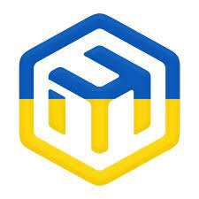

Welcome to Compass documentation!
===================================

**Compass**  is a library for communicate with `RouterOS 7 <https://mikrotik.com/software/>`.

Check out the :doc:`usage` section for further information, including
how to :ref:`installation` the library.

.. note::

   This project is under development.

Contents
--------

.. toctree::
   :hidden:
   :caption: Quickstarts

   quickstarts/overview
   quickstarts/usage

